# Diagramas del Sistema

## 1. Diagrama de Arquitectura

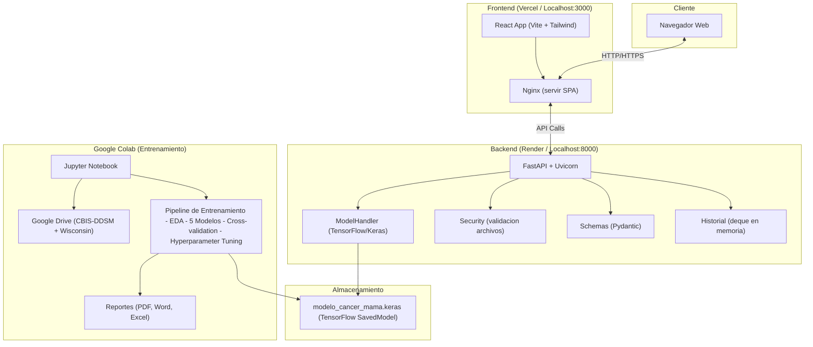

## 2. Diagrama de Modelo de Datos

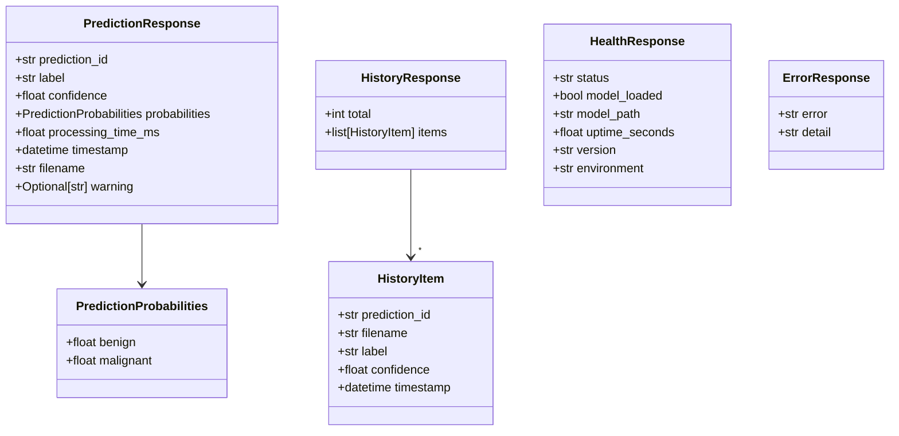

## 3. Diagrama de Componentes

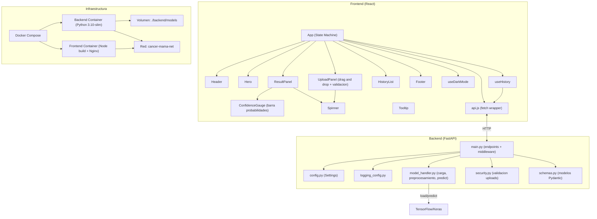

## 4. Diagramas de Secuencia

### 4.1 Flujo de Prediccion

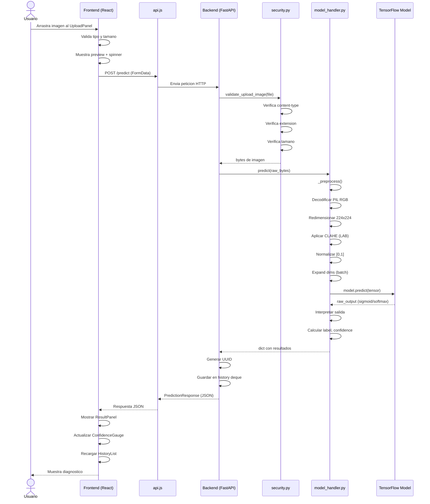

### 4.2 Flujo de Health Check

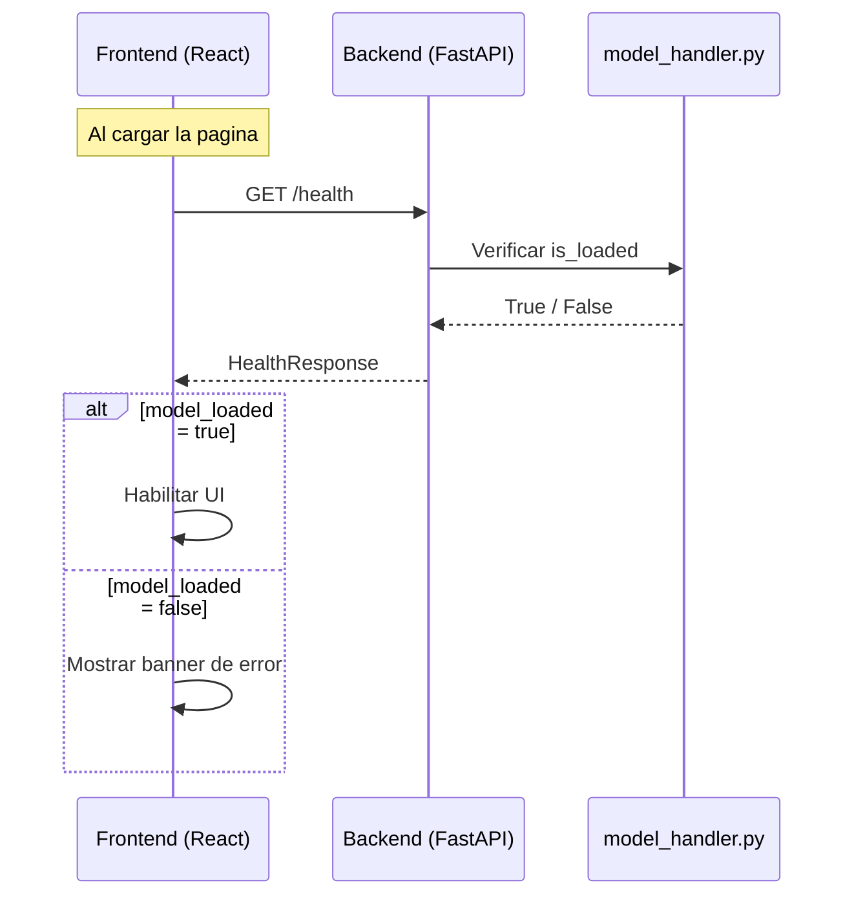

### 4.3 Flujo de Entrenamiento en Colab

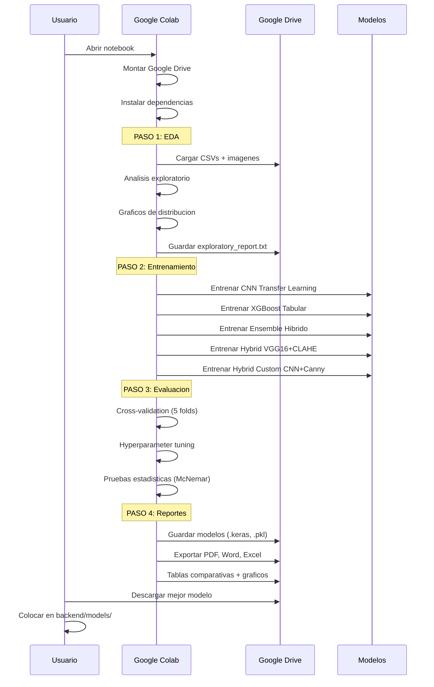

### 4.4 Flujo de Historial

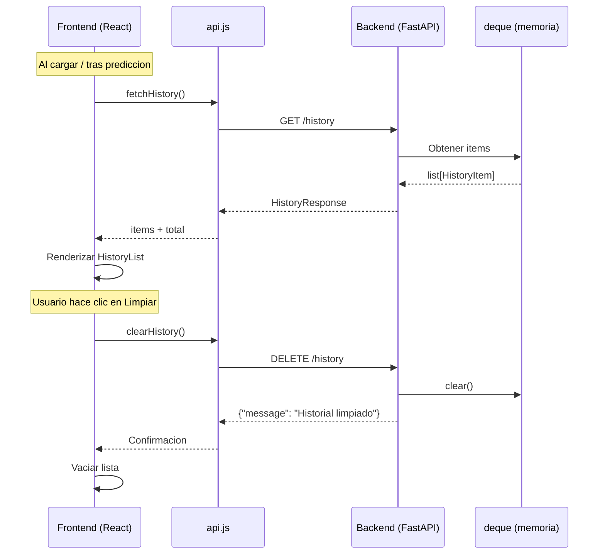

## 5. Diagramas de Estados

### 5.1 Estados de la Aplicacion

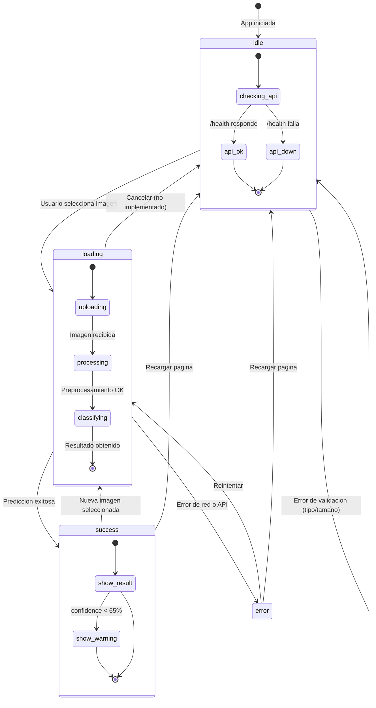

### 5.2 Estados del Modelo

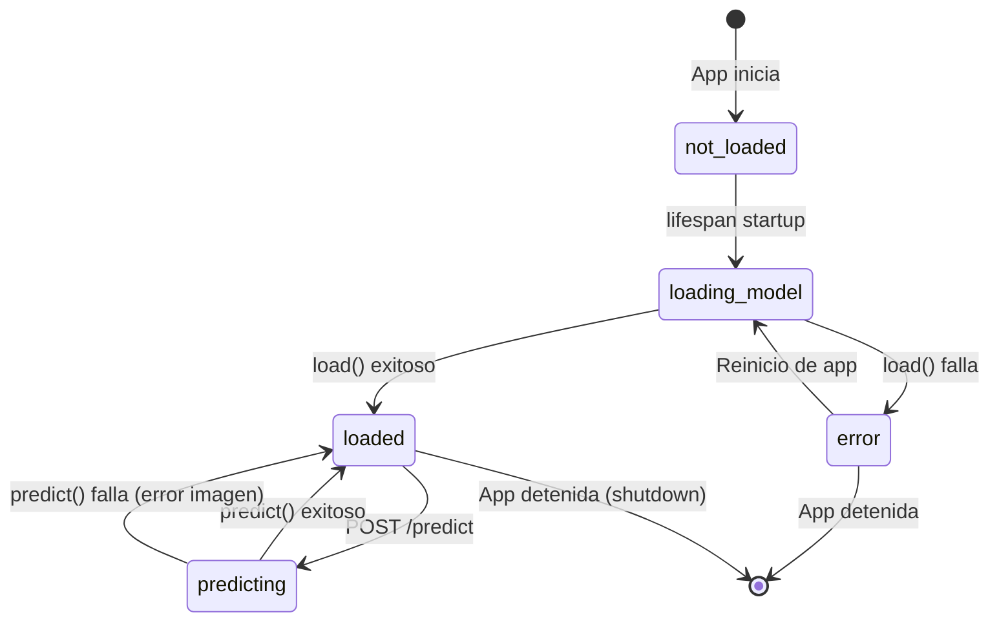

### 5.3 Estados del Historial

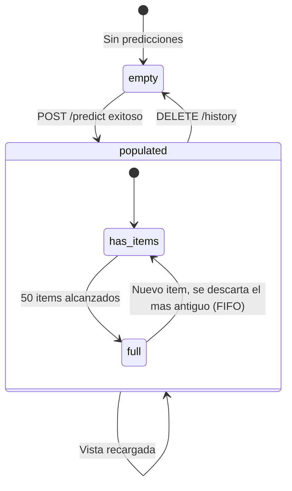

## 6. Diagrama de Despliegue

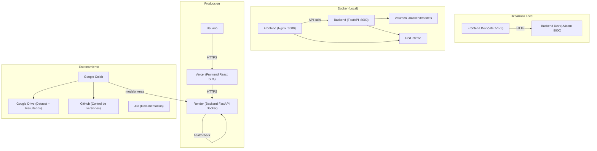
